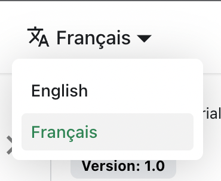

Let's translate `docs/tutor/index.md` to French.

## Configure I18N

Modify `docusaurus.config.ts` to add support for the `fr` locale:

```ts title="docusaurus.config.ts"
export default {
  i18n: {
    defaultLocale: 'en',
    locales: ['en', 'fr']
  }
};
```

## Translate a Doc

Copy the `docs/tutor/index.md` file to the `i18n/fr` folder:

```bash
mkdir -p i18n/fr/docusaurus-plugin-content-docs/current/

cp docs/tutor/index.md i18n/fr/docusaurus-plugin-content-docs/current/intro.md
```

Translate `i18n/fr/docusaurus-plugin-content-docs/current/intro.md` in French.

## Start Your Localized Site

Start your site on the French locale:

```bash
pnpm start -- --locale fr
```

Your localized site is accessible at `http://127.0.0.1:3000/fr/` and the `Getting Started` page is translated.

:::caution

In development, you can only use one locale at a time.

:::

## Add a Locale Dropdown

To navigate seamlessly across languages, add a locale dropdown.

Modify the `docusaurus.config.ts` file:

```ts title="docusaurus.config.ts"
export default {
  themeConfig: {
    navbar: {
      items: [
        // highlight-start
        {
          type: 'localeDropdown'
        }
        // highlight-end
      ]
    }
  }
};
```

The locale dropdown now appears in your navbar:



## Build Your Localized Site

Build your site for a specific locale:

```bash
pnpm build -- --locale fr
```

Or build your site to include all the locales at once:

```bash
pnpm build
```
